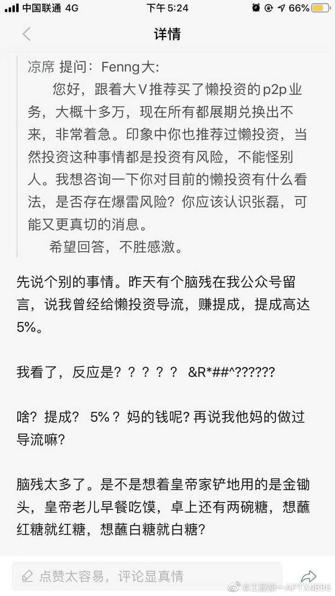
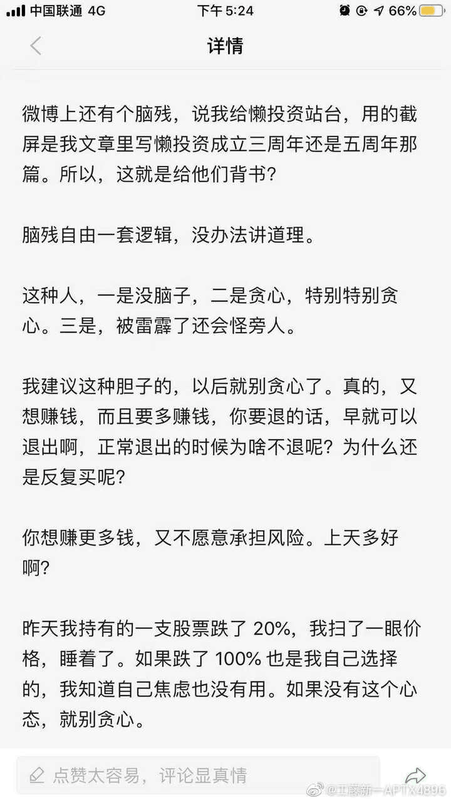

# 懒投资 欺诈 & 失职 事件

## 事件起因

2019.10 起北上深三地投资人开始联合关注懒投资逾期一事儿，参见微博超话 “懒投资”

12 月，随着非官方调查落地，发现有众多违规行为，懒投资风控名存实亡

## 欺诈 & 失职事实

### 风控承诺

磊在介绍产品时，是这么给他和帮他引流的大V 说的 ["有钱交给小张就好了，不管姿势，躺着赚钱"][1]

池建强

### 真真假假 “担保公司”

### 僵尸 优帕克 失联后获贷

## 各方回应

### Fenng

### 池大

## 参考

[1] https://mp.weixin.qq.com/s/aQtkMdOax3KmK9EXrjoxHA
